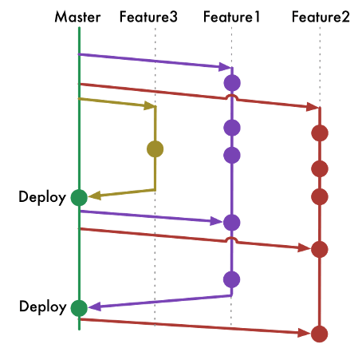

# Hvad skal vi idag?

- Hvad er Git?
  - Eller Github?
  - Source Control kort fortalt
- Anvendelsesområder
  - Source control
    - Både alene
    - Og i Teams
- Git begreber
  - Repository
  - Branch
  - Add
  - Commit
  - Pull / Push
  - Pull Request
  - Master / Main
  - Tags / Releases
- Hvordan kan man bruge Git?
  - [cli](#cli)
  - Sæt Username / Email
  - Visual Studio Code (VSCode)
  - GitHub Desktop
  - Og mange mange flere...
- Praktiske eksempler
  - Oprette et Git Repository
    - Nyt Repository
    - Allerede eksisterende kode
  - VSCode Integration
    - Hvorfor elsker jeg dette?
  - VSCode / Platform IO
    - Eksempler på hvordan man direkte i VSCode kan lave Arduino på den fede måde!
  - GitHub Pages
    - HTML/Markdown uden en server via *.github.io eller eget domain!
- CI / CD - GitHub Actions
  - Continuous Integration
  - Continuous Deployment
- Branching Strategier
  - Trunk
  - Release
  - Feature
  - GitFlow

# Hvad er Git?

Git bliver brugt mellem flere medlemmer af et team - eller kan bruges alene bare for at holde styr på sin kode.


## Git eller Github?

Github er ikke Git, GitHub er en service til at lægge din kode op i Git formatet, GitHub facilitere blot sikkerhed, dokumentation, projektstyring etc. rundt om Git formatet. Der findes mange alternativer til GitHub - men Github er den mest brugte.

Af alternativer kan nævnes GitLab, Azure DevOps, Bitbucket, GitBucket etc.

# Anvendelsesområder

Jeg lægger stort set alt hvad jeg laver personligt i Git af flere grunde

1. Jeg kan se hvad jeg har rettet siden sidst
2. Jeg kan gemme løbende og sige "nu er det her færdig"
3. Jeg kan branche ud (Lave en gren) og arbejde med noget jeg vil teste og så hoppe tilbage til det jeg ved der virker
4. Jeg kan gemme min kode Online så jeg altid kan komme til den
5. Jeg kan bede andre rette i min kode men jeg kan stadigvæk godkende det!

# Git begreber

Der er mange ord / ting i Git som godt kan give en ret stejl indlæringskurve herunder render vi kort indt i dem

## Repository

En mappe der er "tracked" med Git, dvs. der er formentlig en .git mappe i roden af denne mappe.

.git mappen indeholder alle versioner etc. af filer i repository dvs. ud fra den database der ligger i .git mappen kan man gå point in time tilbage til alle ændringer samt se sin log via git.exe eller f.eks. VSCode

## Branch

En gren af koden - standard branch hedder enten master eller main - [anekdote tid](https://faktalink.dk/titelliste/slaveriet-i-usa/slaveriets-efterspil)

Opret ny fra aktuel
```
git.exe branch test-branch
```

HTML Eksempel

```html
<html>
  <head>
    <title>Test</title>
  </head>
<body>
  <h1>Test</h1>
</body>
</html>
```

## Add

Før en fil kan committes skal man vælge at tilføje den til sin Stage area (Filer der er ændret som skal med i commit)

Opret ny fra aktuel
```
git.exe add main.cpp
git add .
```

## Commit

Du gemmer et "snapshot" af din kode med en besked i den pågældende branch du er i - en commit er en lokal ting - denne er først gemt online når den er "Pushed" online

Commit aktuel kode
```
git.exe branch test-branch
```

## Pull/Push

Pull / Push gør det det siger - man henter eller sender rettelser til det kode man har
```
git.exe push
git.exe pull
```

## Pull Request

Et pull request er at trækker de ændring du har lavet i en Brach ind i en anden branch. Grunden til det hedder et request er fordi der er flere step

- Pull Request master <- undvkling
- Review / Approve
- Merge
- Delete udvikling

Et pull request bruges typisk hvis man har flere branches og man gerne vil have noget kode fra en "udviklings branch" ind i master/main branch - eller hvis man er et team og en "Voksen" skal godkende den rettelse man har lavet.

## Tags / Releases

Et Tag/Release er blot en tekst der bliver tilføjet et Commit ID - dvs. man arbejder på version 1.0 af sin software og man har måske 50 commits - men nu vil man gerne sige man har en "færdig" version as is - så sætter man et tag på det pågældende commit.

Dette tag kan man så liste dvs. man får ikke en liste med 3000 commits men alene en liste med "Tags" som man selv har udvalgt som værende f.eks. versioner eller features eller projekt navne.

# Source Control kort fortalt

Source Control bruges til at organisere tekstfiler og tekst indhold på en måde hvor du kan spore ændringer, merge / diff filer for at se hvad er ændret.

Ud over dette får man også en organiseret "backup" af din kildekode, og man åbner op for man kan lave midlertidige ændringer i kildekoden og bare smide det væk igen uden at man skal holde styr på ens filer heletiden med mange kopier.

Jeg plejer at sige at mit Git er det eneste sted sandheden er - alt andet er usikre filer!

## Hvoran kan man bruge Git?

Der er mange måder at bruge Git på.

### cli

Til at snakke med git via cli har man **git.exe** som man kan installere fra [https://git-scm.com/](https://git-scm.com/)

```
usage: git [--version] [--help] [-C <path>] [-c <name>=<value>]
           [--exec-path[=<path>]] [--html-path] [--man-path] [--info-path]
           [-p | --paginate | -P | --no-pager] [--no-replace-objects] [--bare]
           [--git-dir=<path>] [--work-tree=<path>] [--namespace=<name>]
           [--super-prefix=<path>] [--config-env=<name>=<envvar>]
           <command> [<args>]

These are common Git commands used in various situations:

start a working area (see also: git help tutorial)
   clone             Clone a repository into a new directory
   init              Create an empty Git repository or reinitialize an existing one

work on the current change (see also: git help everyday)
   add               Add file contents to the index
   mv                Move or rename a file, a directory, or a symlink
   restore           Restore working tree files
   rm                Remove files from the working tree and from the index
   sparse-checkout   Initialize and modify the sparse-checkout

examine the history and state (see also: git help revisions)
   bisect            Use binary search to find the commit that introduced a bug
   diff              Show changes between commits, commit and working tree, etc
   grep              Print lines matching a pattern
   log               Show commit logs
   show              Show various types of objects
   status            Show the working tree status

grow, mark and tweak your common history
   branch            List, create, or delete branches
   commit            Record changes to the repository
   merge             Join two or more development histories together
   rebase            Reapply commits on top of another base tip
   reset             Reset current HEAD to the specified state
   switch            Switch branches
   tag               Create, list, delete or verify a tag object signed with GPG

collaborate (see also: git help workflows)
   fetch             Download objects and refs from another repository
   pull              Fetch from and integrate with another repository or a local branch
   push              Update remote refs along with associated objects

'git help -a' and 'git help -g' list available subcommands and some
concept guides. See 'git help <command>' or 'git help <concept>'
to read about a specific subcommand or concept.
See 'git help git' for an overview of the system.
```

## Visual Studio Code (VSCode)

I min optik har VSCode den bedste integration, da VSCode er mere end bare en editor, næsten alle de ting jeg arbejder med køre via VSCode.

VSCode har en meget effektiv integration til Git hvor man nemt kan se hvor filer er ændret, samt man har mulighed for på en nem måde at vedligeholde Git filer.

Demotid!

## GitHub Desktop

Der findes også en GUI til GitHub som hedder [GitHub Desktop](https://desktop.github.com/) - jeg har aldrig rigtig brugt den, da det bare vil være 2 værktøjer til det samme, men den kan være aktuel hvis man f.eks. udvikler til Arduino IDE hvor Git ikke er en integreret del.

## Alle de andre..

Ja der er også Visual Studio, Atom editor osv osv.. 

### Sæt Username / Email

Alle commits etc. bliver påført hvem der har lavet det så før man kan committe / bruge git skal git vide hvem man er og det kan sættes via nedenstående kommando.

```
git config --global user.name "Dit fulde navn"
git config --global user.email "Den email adresse du logger på GitHub med"
```

# Praktiske eksempler - Demo tid!

Nu skal vi se lidt demoer

- Oprette et Git Repository
  - Nyt Repository
  - Allerede eksisterende kode
- VSCode Integration
  - Hvorfor elsker jeg dette?
- GitHub Pages
  - HTML/Markdown uden en server via *.github.io eller eget domain!
- Nyttige kommandoer
  - git status

# CI / CD - GitHub Actions

Infrastruktur as Code - eller Test som kode / tekst, med CI / CD sker der automatisk noget med dit program når du uploader / ændre en fil - det kan f.eks. være

Du retter i din Source Code og comitter til en Test branch
Systemet compiler / eller laver en Docker fil for dig og laver en docker Container
Docker container uploades til Docker Hub
Din test WebServer får besked på at hente nyeste site

På denne måde automatisere man udviklingen og bygger nogle avanceret flows der gør mere end bare gemme indholde, dette har en masse foredele blandt andet du kan release hver gang du laver en test.

## Continuous Integration
Køre / Bygge / teste kode

## Continuous Deployment
Bede server / service om at bruge kode (Lægge i drift)

# Branching Strategier

Det der virker for dig er bedst - der er et hav af strategier man kan benytte

## Trunk Based

Den simpleste form - du har 1 spor som hedder Main eller Master



## Release Based

Du har en Branch for hver release, det har den fordel at du kan lave Hotfixes pr. release - men har også den ulempe at det kan blive en meget stor kode base at holde styr på hvis man har alle major / minor versioner.

Bruges typisk hvis man skal vedligeholde mange versioner inklusiv de ældre versioner hvor man har brug for at komme tilbage til version 1.2 og lave en hotfix - selvom man arbejder på version 2.5.

## Feature Based

Du har f.eks. et website eller noget Arduino kode, der har man ikke flere versioner men man udvikler features dvs. man har sin "hoved kode" og derfra udvikler man flere og flere features man trækker ind i main / master - men man har reelt kun 1 version der er den "gældende"

## Git Flow

Det kan være meget kompliceret med GitFlow strategien


