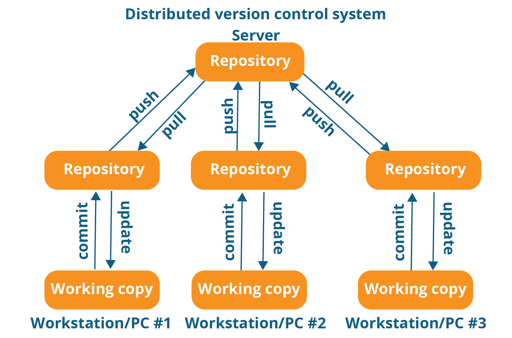
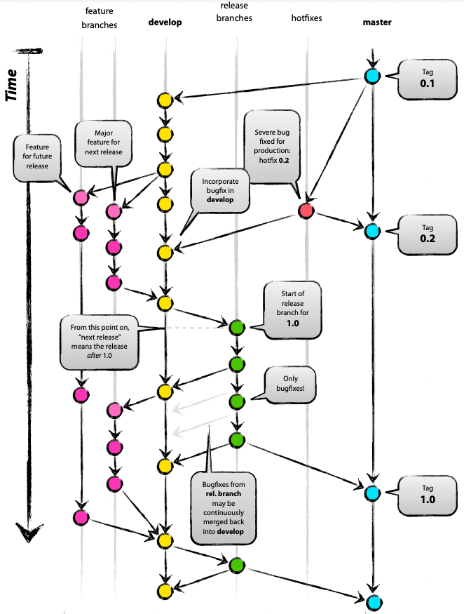

# Hvad skal vi idag?

- Hvad er Git?
  - Eller Github?
  - Source Control kort fortalt
- Git begreber
  - Repository
  - Branch
  - Pull / Push
  - Commit
  - Pull Request
  - Master / Main
- Hvordan kan man bruge Git?
  - cli
  - Visual Studio Code (VSCode)
  - Visual Studio
  - GitHub Desktop
  - Atom Editor
  - Og mange mange flere...
- Anvendelsesområder
  - Source control
    - Både alene
    - Og i Teams
- Praktiske eksempler
  - Oprette et Git Repository
    - Nyt Repository
    - Allerede eksisterende kode
  - VSCode Integration
    - 
  - GitHub Pages
    - HTML/Markdown uden en server via *.github.io eller eget domain!
- Branching Strategier
  - [Trunk Based](#trunk-based)

## Hvad er Git?

Git bliver brugt mellem flere medlemmer af et team - eller kan bruges alene bare for at holde styr på sin kode.



### Git eller Github?

Github er ikke Git, GitHub er en service til at lægge din kode op i Git formatet, GitHub facilitere blot sikkerhed, dokumentation, projektstyring etc. rundt om Git formatet. Der findes mange alternativer til GitHub - men Github er den mest brugte.

Af alternativer kan nævnes GitLab, Azure DevOps, Bitbucket, GitBucket etc.

### Git begreber

Der er mange ord / ting i Git som godt kan give en ret stejl indlæringskurve herunder render vi kort indt i dem

# Repository
# Branch
# Pull/Push
# Commit
# Pull Request
# Master / Main

### Source Control kort fortalt

Source Control bruges til at organisere tekstfiler og tekst indhold på en måde hvor du kan spore ændringer, merge / diff filer for at se hvad er ændret.

Ud over dette får man også en organiseret "backup" af din kildekode, og man åbner op for man kan lave midlertidige ændringer i kildekoden og bare smide det væk igen uden at man skal holde styr på ens filer heletiden med mange kopier.

Jeg plejer at sige at mit Git er det eneste sted sandheden er - alt andet er usikre filer!

## Hvoran kan man bruge Git?

Der er mange måder at bruge Git på.

### cli

Til at snakke med git via cli har man **git.exe** som man kan installere fra [https://git-scm.com/](https://git-scm.com/)

```
usage: git [--version] [--help] [-C <path>] [-c <name>=<value>]
           [--exec-path[=<path>]] [--html-path] [--man-path] [--info-path]
           [-p | --paginate | -P | --no-pager] [--no-replace-objects] [--bare]
           [--git-dir=<path>] [--work-tree=<path>] [--namespace=<name>]
           [--super-prefix=<path>] [--config-env=<name>=<envvar>]
           <command> [<args>]

These are common Git commands used in various situations:

start a working area (see also: git help tutorial)
   clone             Clone a repository into a new directory
   init              Create an empty Git repository or reinitialize an existing one

work on the current change (see also: git help everyday)
   add               Add file contents to the index
   mv                Move or rename a file, a directory, or a symlink
   restore           Restore working tree files
   rm                Remove files from the working tree and from the index
   sparse-checkout   Initialize and modify the sparse-checkout

examine the history and state (see also: git help revisions)
   bisect            Use binary search to find the commit that introduced a bug
   diff              Show changes between commits, commit and working tree, etc
   grep              Print lines matching a pattern
   log               Show commit logs
   show              Show various types of objects
   status            Show the working tree status

grow, mark and tweak your common history
   branch            List, create, or delete branches
   commit            Record changes to the repository
   merge             Join two or more development histories together
   rebase            Reapply commits on top of another base tip
   reset             Reset current HEAD to the specified state
   switch            Switch branches
   tag               Create, list, delete or verify a tag object signed with GPG

collaborate (see also: git help workflows)
   fetch             Download objects and refs from another repository
   pull              Fetch from and integrate with another repository or a local branch
   push              Update remote refs along with associated objects

'git help -a' and 'git help -g' list available subcommands and some
concept guides. See 'git help <command>' or 'git help <concept>'
to read about a specific subcommand or concept.
See 'git help git' for an overview of the system.
```

## Branching Strategier

Det kan være meget kompliceret med GitFlow strategien



Det kan også være rigtig enkelt med Trunk Based


### Trunk Based